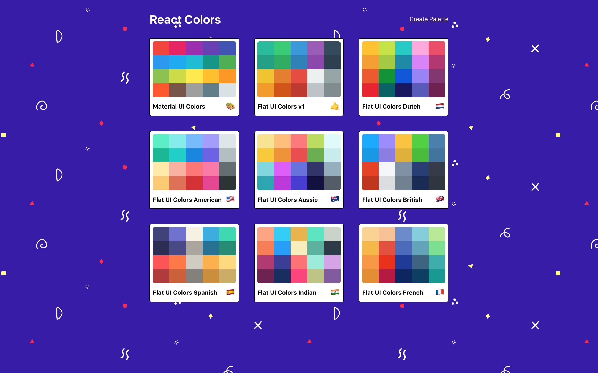
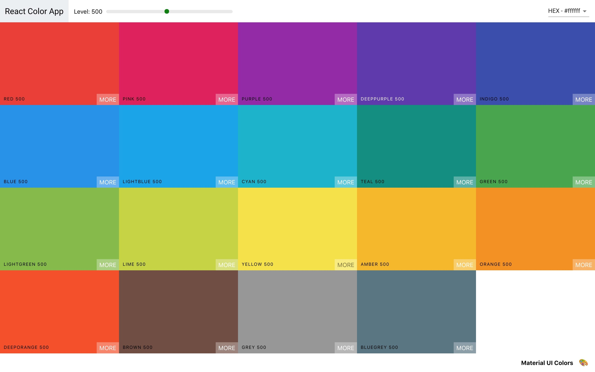
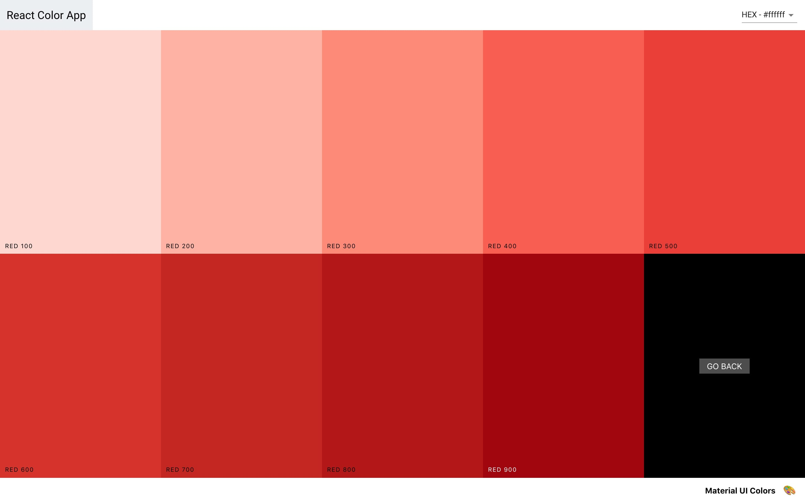
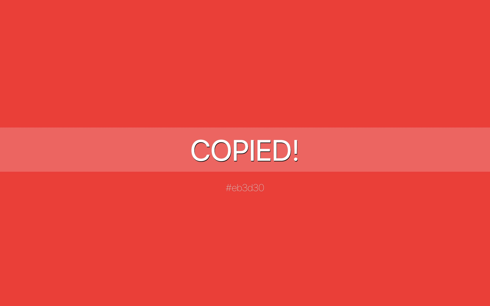
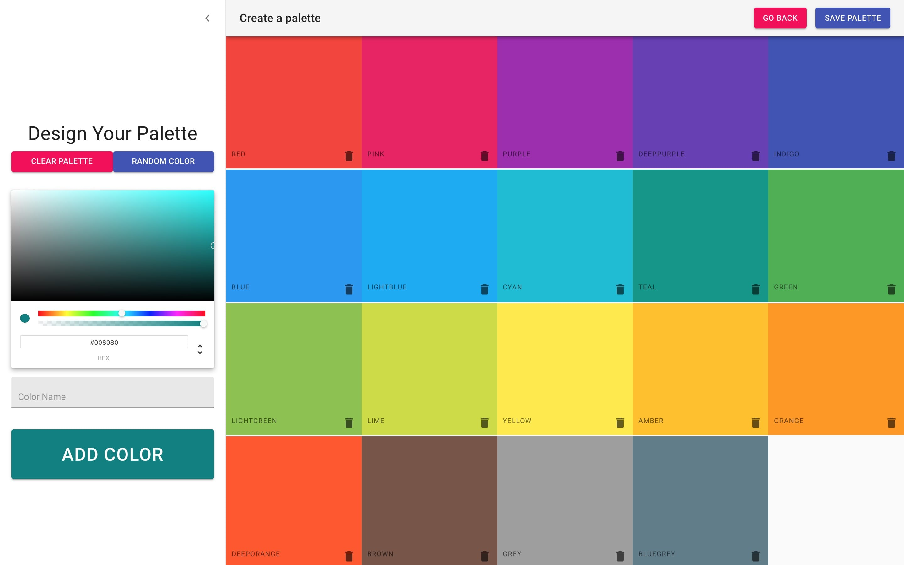

# Colors App

An application for creating color palettes. Build in React.

[Colors app](https://www.colorsapp.tjebbemarchand.nl/)

## Features

-   Create your own palettes
-   Give it your own name and emoji
-   Delete palettes
-   Change colors
-   See all color variants
-   Copy colors in different color codes

## Screenshots

